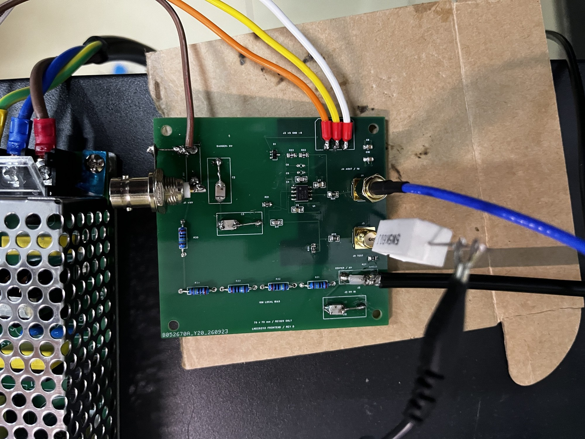
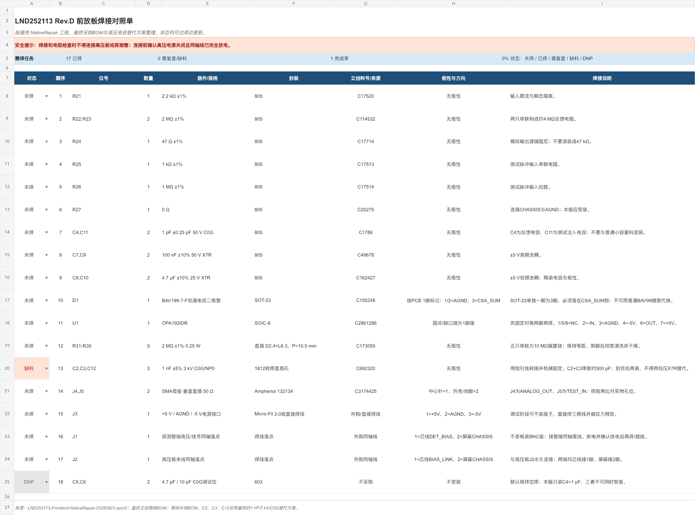
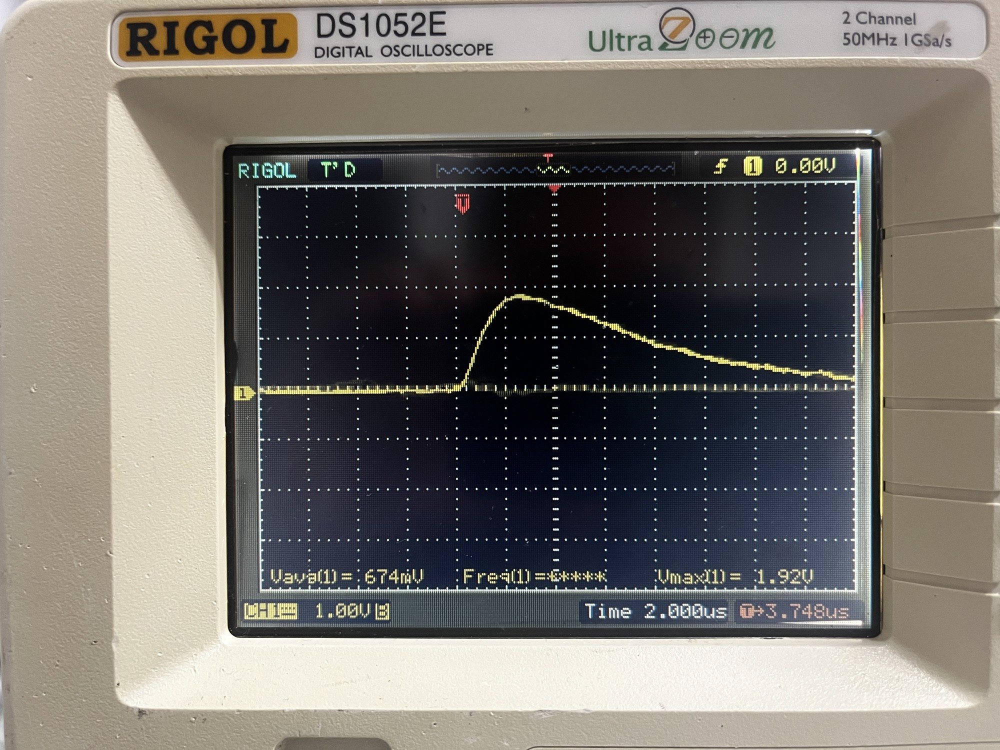
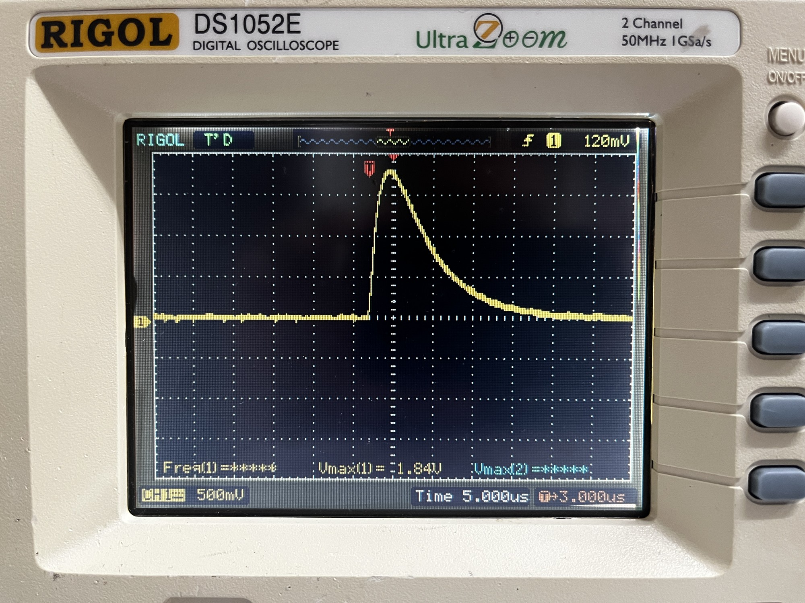
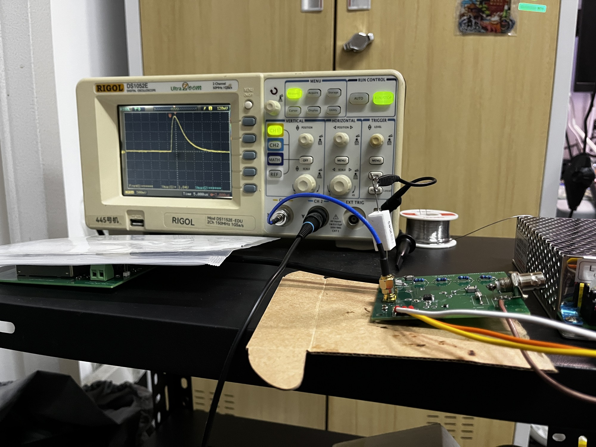

# Aster CSA：电荷灵敏前置放大器

[English](README.md)

这是 Aster 核电子学仪器系列中的一块开源低成本电荷灵敏前置放大器（CSA）与偏置 T 型网络原型板。核心器件只有一颗 OPA192，板上带测试电荷注入口、输入保护、约 4 MΩ / 1 pF 反馈网络和带 47 Ω 源端阻尼的模拟输出。

该板面向“探测器偏置与信号共用一根同轴线”的连接方式，但**不包含高压电源本身**。

> **当前状态：**一块实物已完成低压供电、基线和板载测试电荷注入验证。尚未完成精密标定、探测器计数验证、EMC 测试或安全认证。



*正在进行板载电荷注入测试的 Aster CSA Rev.D 实物原型。*



## 主要参数

| 项目 | 原型值 |
|---|---:|
| 运放 | OPA192IDR |
| 供电 | +5 V / AGND / -5 V |
| 标称反馈电容 | 1 pF C0G |
| 标称反馈电阻 | 约 4 MΩ |
| 标称恢复时间常数 | 约 4 µs |
| 理论电荷增益 | 约 1 V/pC |
| 初步实测电荷增益 | 约 0.60–0.64 V/pC |
| 实测上升至峰值时间 | 约 3 µs |
| 实测完全恢复时间 | 约 20 µs |
| 噪声 / ENC | 尚未测量 |
| 模拟输出 | SMA，串联 47 Ω 阻尼 |
| 测试输入 | SMA，板载 1 pF 电荷注入电容 |

## 初步电荷注入测试结果

初步测试使用示波器标称 0–3 V、1 kHz 校准方波，并在外部串联 5.65 kΩ 电阻。方波经板载标称 1 pF 注入电容输入，测得输出峰值约 1.84–1.92 V。

按标称元件值计算：

- 注入电荷量：`Q = C_inj × ΔV = 1 pF × 3 V = 3 pC`；
- 实测电荷增益：`1.84–1.92 V / 3 pC = 0.61–0.64 V/pC`；
- 平均实测电荷增益约为 `0.63 V/pC`；
- 按 `C = Q / V_peak` 反推的等效反馈电容约为 `1.56–1.63 pF`，以平均峰值计算约为 `1.60 pF`；
- 标称反馈时间常数为 `4 MΩ × 1 pF = 4 µs`，五个时间常数约为 `20 µs`，与波形恢复至基线的实测结果基本一致。

脉冲上升至峰值约需 3 µs，约 20 µs 后基本完全恢复至基线。1 kHz 方波的相邻边沿间隔为 500 µs，因此本次测试中不应出现明显脉冲堆积。示波器校准输出不是精密信号源，1 pF 量级的电容容差与寄生参数不可忽略，外串 5.65 kΩ 电阻也会与测试网络共同作用，因此这些结果只能视作功能性估算，不能作为可溯源标定。噪声频谱密度与等效噪声电荷（ENC）尚未测量。



*观测到的脉冲前沿与峰值，上升至峰值时间约 3 µs。*



*输出约在 20 µs 内恢复至接近基线。*



*首次板载电荷注入功能测试的实验台连接。*

## 测试注入路径

```text
J5 TEST_IN 中心针
      |
   R25 1 kΩ
      |
  TEST_PULSE ---- R26 1 MΩ ---- AGND
      |
   C11 1 pF C0G
      |
   CSA_SUM
```

J5 已经带有板载注入电容，不需要再外接一颗串联注入电容。正阶跃会在输出端产生负脉冲；方波的上升沿与下降沿会分别产生方向相反的脉冲。

## 文件说明

- `hardware/Aster-CSA-RevD-EasyEDA-Pro.epro2`：立创 EDA 专业版原生工程，包含原理图和四层 PCB。
- `docs/assembly-checklist.xlsx`：焊接和上电检查清单。
- `bom/BOM.csv`：单板用量 BOM，包含可确定的立创商城料号。
- `bom/external-and-dnp.csv`：外购、机械件及默认不装器件。

## 导入立创 EDA

1. 在立创 EDA 专业版中选择“文件 → 导入 → 立创 EDA（专业版）”，导入 `.epro2`。
2. 打开 PCB 后按 `Shift+B` 重建铺铜。
3. 确认三块电源/地平面：底层为 `-5VA`、内层 1 为 `AGND`、内层 2 为 `+5VA`。
4. 重新运行 DRC。修复后的参考工程曾通过 124 项检查并显示 0 个问题。
5. 下单前必须在 Gerber 预览中逐层确认实际存在走线和铺铜，不能只依赖 DRC 绿灯。

首版仓库不提供可直接下单的 Gerber。请从原生工程重建铺铜、核实连接器封装后重新导出生产文件。

## 实物装配覆盖项

实物原型有几处器件选择覆盖了旧 CAD 元数据。复现实测装配时应以仓库 BOM 和以下内容为准：

- `R21 = 2.2 kΩ`，不是 0 Ω；
- `R24 = 47 Ω`，不是 2 kΩ；
- `D1` 应安装 `BAV199-7-F`，即使导入后的隐藏属性仍显示 DNP；
- 实物的 `C2`、`C3`、`C12` 使用 1 nF、3 kV、C0G；原生工程中 C2/C3 的可见数值仍保留早期 560 pF 选项。

这些装配覆盖项不改变 PCB 拓扑与连线。原生工程用于保留已经修复的可制造铜连接，仓库 CSV BOM 用于记录实测样机的器件配置。

## 基本测试方法

1. 不接探测器高压。
2. 用带限流的 ±5 V 电源给前放板供电。
3. 示波器高阻输入观察输出基线，确认无饱和与持续振荡。
4. 从 J5 输入一个较小的正阶跃；使用信号发生器时建议从 0.5 V 以下开始。
5. J4 应得到负向脉冲。
6. 使用多个输入幅度测量，并按 `Q = C_inj × ΔV` 拟合输出峰值与注入电荷的关系。

上述 3 V 示波器方波只用于首次功能验证，不应当作精密校准。

## 高压安全

这是实验室原型，不是经过认证的高压产品。

- 与外部高压模块组合后，探测器和偏置接口可能带有约 1 kV 电压。
- BAV199 与 2.2 kΩ 只能提供原型级输入保护，不能保证高压热插拔或探测器打火安全。
- 接线、焊接或触摸前必须关闭高压、等待放电，并实测确认电压已经下降。
- 只能在清洁、干燥、绝缘且人员无法触及高压导体的外壳内运行。
- 同轴与电源连接器封装必须用实际采购件再次核对。

## 已知限制

- `CSA_SUM` 敏感节点走线偏长，可能增加寄生电容和环境拾取。
- 实测电荷增益低于标称理论值，需要用已知信号源重新标定。
- 噪声频谱密度与等效噪声电荷（ENC）尚未测量。
- 当前测试只证明了低压前放与注入通路工作，尚未完成探测器计数验证。
- 高压隔直电容及部分连接器需要单独外购。

## AI 使用披露

电路审查、文档编写、连接性检查和发布整理使用了 OpenAI Codex 辅助。实物焊接、测量和最终实验判断由项目所有者完成。AI 分析不能代替独立的电气与高压安全审查。

## 许可证

本项目使用 MIT License，见 [LICENSE](LICENSE)。
